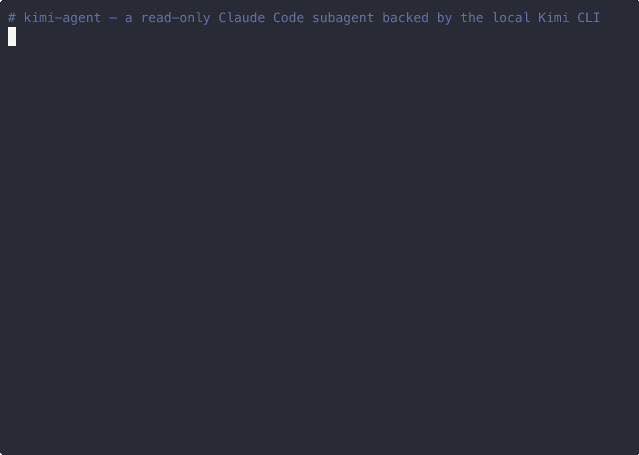

# claude-code-kimi-agent

[English](README.md) | **简体中文**

一个 [Claude Code](https://docs.claude.com/en/docs/claude-code) subagent，把"自主探索 / 读代码 / debug"类任务委派给本地的 [Kimi CLI](https://github.com/MoonshotAI/kimi-cli)（Moonshot AI）执行。**默认只读**——约束落在 Kimi 的工具分发层，不依赖 prompt 层信任。



*演示：kimi-agent 先用 `Glob` 工具自己探索一个 mock 仓库；接着尝试写文件被明确拒绝（因为 `WriteFile` / `StrReplaceFile` / `Shell` 都在 YAML 里被 exclude 了）；最后在磁盘上确认文件从未被创建。*

## 为什么要做这个

Claude Code 本来就支持把任务丢给第三方 CLI —— OpenAI 官方的 `codex-rescue` subagent 就是这样把任务转给 Codex CLI。这个项目把同一套思路复刻到 **Kimi** 上：训练谱系不同（Moonshot，不是 OpenAI），可以得到真正独立的第三方视角；默认锁成只读，不会乱改仓库。

各工具的定位：

| | 执行位置 | 能自主读文件 | 能写/执行 |
|---|---|:---:|:---:|
| `codex-rescue`（OpenAI）        | 本地 CLI | ✅ | ✅（可写）|
| **`kimi-agent`（本项目）**       | **本地 CLI** | **✅** | **❌（OS 级只读）**|
| Kimi MCP（`kimi_analyze`）      | 远程 API | ❌（需要 prompt 带内容）| ❌ |
| DeepSeek MCP（`deepseek_ask`）  | 远程 API | ❌（需要 prompt 带内容）| ❌ |

适用场景：你希望 **Kimi 自己去探索代码仓库**（而不是你把代码塞进 prompt 喂给它），但又**不想它改任何东西**。

## "只读"是怎么实现的

Kimi CLI 支持通过 `--agent-file` 加载自定义 agent 定义。本项目附带的 YAML 继承默认 agent，但把所有可写工具全部 exclude 掉：

```yaml
version: 1
agent:
  extend: default
  exclude_tools:
    - "kimi_cli.tools.file:WriteFile"
    - "kimi_cli.tools.file:StrReplaceFile"
    - "kimi_cli.tools.shell:Shell"
```

Kimi 在这个 session 里可用的工具只剩 `ReadFile` / `ReadMediaFile` / `Glob` / `Grep`（以及 web search 等纯读操作）。**不存在的工具没办法被 prompt 越狱**——写工具在这个 session 里根本不存在。

已验证行为：当要求 Kimi 创建文件时，它会回答"工具集不包含 Shell 或 WriteFile"，磁盘上也确实不会出现新文件。

## 运行环境要求

- [Claude Code](https://docs.claude.com/en/docs/claude-code)（CLI / IDE 插件均可）
- [Kimi CLI](https://github.com/MoonshotAI/kimi-cli) —— **需要有效的 Kimi 订阅**。先装 CLI，然后执行一次 `kimi login` 完成登录。没有有效订阅的话，本 subagent 跑不出结果。
- `gtimeout`（macOS：`brew install coreutils`）**或** `timeout`（Linux 一般自带）
- Bash（macOS / Linux 默认 shell 即可）

## 安装

```bash
git clone https://github.com/zcyyyds-test/claude-code-kimi-agent.git ~/code/claude-code-kimi-agent
cd ~/code/claude-code-kimi-agent
./install.sh
```

`install.sh` 幂等，会先检查依赖，再创建两个软链：
- `agents/kimi-agent.md` → `~/.claude/agents/kimi-agent.md`
- `agents/kimi-agent.read-only.yaml` → `~/.claude/agents/kimi-agent.read-only.yaml`

安装完**重启 Claude Code** 让它识别新 subagent。

## 使用方式

在 Claude Code 里通过 `Agent` 工具派发任务：

```
Agent(
  subagent_type="kimi-agent",
  prompt="读 src/auth/session.ts，解释 refresh-token 轮换流程，重点看有无竞态条件。",
  run_in_background=true,
)
```

或者让主 Claude 线程在遇到 `agents/kimi-agent.md` 里描述的场景时自动派发。

subagent 内部只会构造一条 Bash 命令，大致长这样：

```bash
gtimeout 600 bash -c '... kimi --quiet --agent-file <yaml> -p "$1" -w "$2" 2>&1' _ '<PROMPT>' '<WORK_DIR>'
```

几个要点：
- Prompt 作为**位置参数**传递，外层 shell 完全不解析 `$VAR` / `$(cmd)` / 反引号 / 换行 / 引号——注入路径被根除。
- 同步调用，硬性封顶 10 分钟；Kimi 自身没有后台模式。
- 失败场景（找不到 binary / 超时 / API key 缺失）会把合并后的 stdout+stderr 原样交给主线程。

## 已做的安全测试

| 场景 | 结果 |
|---|---|
| 只读：让 Kimi 创建 `/tmp/kimi-write-test.txt` | Kimi 自述"工具集缺 Shell/WriteFile"而拒绝；磁盘上文件不存在 |
| 注入：prompt 含 `$HOME` / `$(whoami)` / 反引号 / 引号 / 换行 | 全部以字面量保留，外层 shell 没有展开 |
| Fail-fast：PATH 里没有 kimi | 0 秒退 127 并给出清晰错误 |
| 超时：任务超过 10 分钟 | `gtimeout` 返回 exit 124 |

## 致谢

subagent 的结构（thin forwarding wrapper、只给 `Bash` 工具、selection-guidance 布局）参考了 OpenAI Codex Claude Code 插件中的 [`codex-rescue`](https://github.com/openai/codex-plugin-cc) subagent。本项目把同一模式搬到另一个 CLI（Kimi）上，并把默认风险姿态收紧为只读。

## License

[MIT](LICENSE)。

## 免责声明

本项目与 Moonshot AI、Anthropic、OpenAI 均无任何附属关系。"Kimi" 和 "Claude Code" 是各自公司的商标。本项目是第三方适配层，仅通过各厂商官方文档公开的 CLI / API 接口进行调用。
